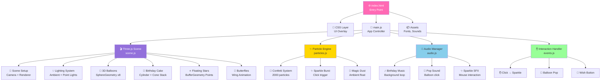
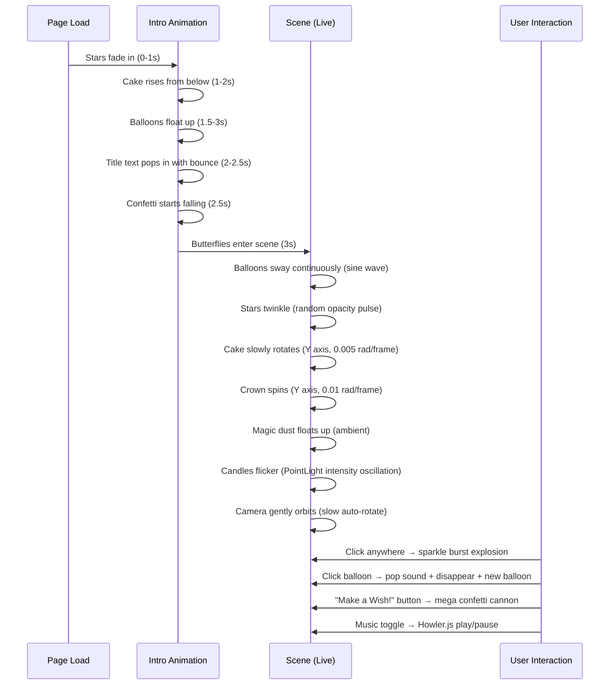
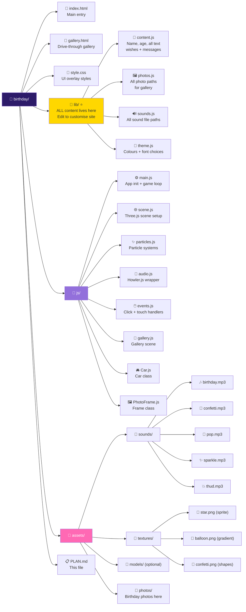
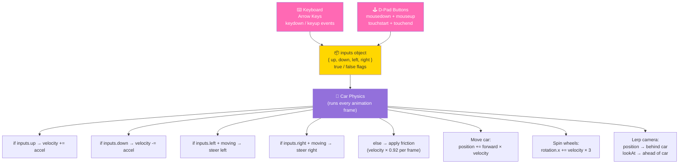
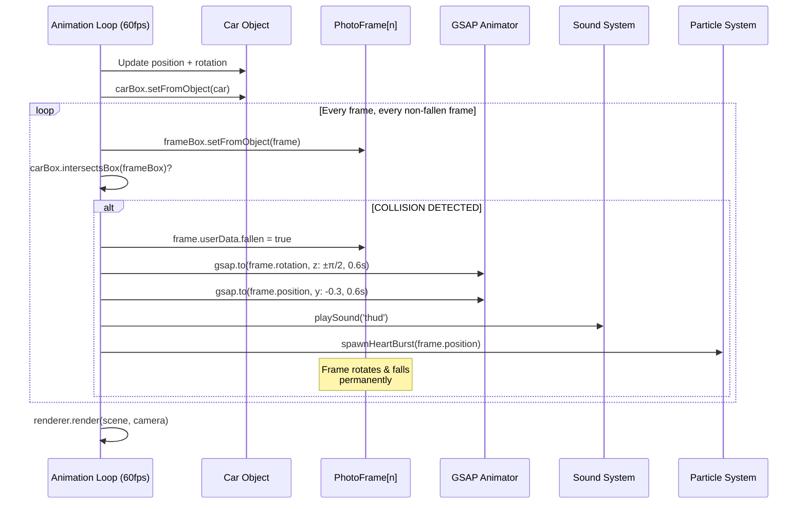
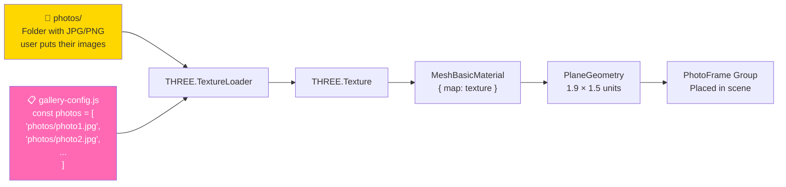
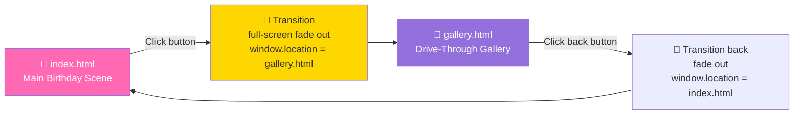

# 🎂 Magical 3D Birthday Wish Website — Full Design Plan
### For a Turning 3 Years Old Princess Girl

> **How to preview this file in VS Code:**
> 1. Install the extension: **"Markdown Preview Mermaid Support"** (by Matt Bierner)
> 2. Open this file → press `Ctrl + Shift + V` to open Preview
> 3. Or right-click the tab → **Open Preview**
> All diagrams below will render as beautiful visual charts!

---

## 🌟 Concept: "The Magical Fairy Garden Party"

A full-screen 3D interactive birthday experience set in a **glowing, magical fairy garden at night** — with floating balloons, confetti, a glowing birthday cake, twinkling stars, and animated butterflies. When you click anywhere, **sparkle bursts** explode. The scene is alive, joyful, and built just for a little princess.

---

## 🎨 Color Palette

| Name | Hex | Role |
|------|-----|------|
| Princess Pink | `#FF69B4` | Primary / Balloons |
| Deep Magenta | `#FF1493` | Text accents |
| Royal Purple | `#9370DB` | Background gradients |
| Midnight Purple | `#2D1B69` | Deep background |
| Lavender Dream | `#E6D5FF` | Soft glow |
| Fairy Gold | `#FFD700` | Stars / Candles |
| Peach Blush | `#FFB6D9` | Confetti |
| Sky Blue | `#87CEEB` | Balloon mix |
| Mint Green | `#98FF98` | Balloon mix |
| Cream White | `#FFFAF0` | Text / UI |

---

## 🗺️ Website Layout (ASCII Wireframe)

```
╔══════════════════════════════════════════════════════════════╗
║                     🌟 THREE.JS CANVAS 🌟                    ║
║  ┌─────────────────────────────────────────────────────────┐ ║
║  │  ✨ Stars / Particles Rain (background layer)           │ ║
║  │                                                         │ ║
║  │    🎈  🎈  🎈  (floating 3D balloons going up)  🎈  🎈  │ ║
║  │                                                         │ ║
║  │         ╔═══════════════════════════╗                   │ ║
║  │         ║  Happy Birthday,          ║  ← HTML overlay   │ ║
║  │         ║  [Princess Name]! 👑      ║    (Fredoka One)  │ ║
║  │         ║  You are 3 today! 🌟      ║                   │ ║
║  │         ╚═══════════════════════════╝                   │ ║
║  │                                                         │ ║
║  │              🎂 (3D spinning cake center)               │ ║
║  │         🦋          🌸          🦋                      │ ║
║  │                                                         │ ║
║  │  🎉 Confetti falls from top (3D particle system) 🎉     │ ║
║  │                                                         │ ║
║  │  [ 🎵 Music ON/OFF ]    [ 🎆 Make a Wish! ]            │ ║
║  └─────────────────────────────────────────────────────────┘ ║
╚══════════════════════════════════════════════════════════════╝
```

---

## 🏗️ Site Architecture



---

## 🎬 Three.js Scene Graph

```mermaid
graph TB
    ROOT[🌐 THREE.Scene] --> CAM[📷 PerspectiveCamera\nFOV: 75 | Near: 0.1 | Far: 1000]
    ROOT --> LIGHTS[💡 Lighting Group]
    ROOT --> OBJECTS[🎭 Objects Group]
    ROOT --> PARTICLES[✨ Particles Group]
    ROOT --> RENDERER[🖥️ WebGLRenderer\nAntialiasing ON\nAlpha: true]

    LIGHTS --> L1[☀️ AmbientLight\n#E6D5FF | intensity: 0.4]
    LIGHTS --> L2[💗 PointLight 1\n#FF69B4 | intensity: 1.5\npos: 0,10,0]
    LIGHTS --> L3[💛 PointLight 2\n#FFD700 | intensity: 1.0\npos: -5,5,5]
    LIGHTS --> L4[💜 DirectionalLight\n#9370DB | intensity: 0.8]

    OBJECTS --> CAKE[🎂 CakeGroup\npos: 0,0,0]
    OBJECTS --> BALLOONS[🎈 BalloonsGroup\n8 balloons, random pos]
    OBJECTS --> STARS[⭐ StarField\nPoints: 500]
    OBJECTS --> BUTTERFLIES[🦋 ButterflyGroup\n4 butterflies]
    OBJECTS --> CROWN[👑 CrownMesh\nRotating top center]

    CAKE --> TIER1[CylinderGeometry\nr:2, h:1 - Base tier]
    CAKE --> TIER2[CylinderGeometry\nr:1.5, h:0.8 - Middle tier]
    CAKE --> TIER3[CylinderGeometry\nr:1, h:0.6 - Top tier]
    CAKE --> CANDLES[CylinderGeometry x3\nwith PointLight flame]
    CAKE --> DECO[SphereGeometry\nPink/Purple balls]

    PARTICLES --> CONFETTI[BufferGeometry\n2000 colored quads\nFalling animation]
    PARTICLES --> SPARKLE[BufferGeometry\nClick burst: 100 pts]
    PARTICLES --> MAGICUST[BufferGeometry\n300 floating particles]

    style ROOT fill:#2D1B69,color:#fff
    style PARTICLES fill:#FFD700,color:#333
    style LIGHTS fill:#FF69B4,color:#fff
    style OBJECTS fill:#9370DB,color:#fff
```

---

## ⏱️ Animation Timeline



---

## 📁 File Structure



---

## 🧩 3D Elements Breakdown

### 🎈 Balloons (Procedural - No model needed)
```
Geometry:  SphereGeometry(0.8, 16, 16)
Material:  MeshPhongMaterial - shininess: 100
Colors:    Cycle through: #FF69B4, #FFD700, #87CEEB, #98FF98, #FF6B6B, #9370DB
String:    TubeGeometry (thin curved line below)
Animation: position.y += Math.sin(time + offset) * 0.002
           position.x += Math.cos(time + offset) * 0.001
Count:     8 balloons floating at different heights/positions
```

### 🎂 Birthday Cake (Procedural - No model needed)
```
Layer 1 (Base):   CylinderGeometry(2, 2, 1)    - Pink frosting
Layer 2 (Middle): CylinderGeometry(1.5, 1.5, 0.8) - Purple frosting
Layer 3 (Top):    CylinderGeometry(1, 1, 0.6)  - White frosting
Candles (x3):     CylinderGeometry(0.05, 0.05, 0.4) - Pink/Yellow
Flame:            PointLight per candle + SphereGeometry(0.05) emissive orange
Deco balls:       SphereGeometry(0.1) scattered on edges - gold/pink
Number "3":       TextGeometry OR HTML overlay with CSS 3D transform
```

### ⭐ Star Field (Particle System)
```
Geometry:    BufferGeometry - 500 points, random sphere distribution
Material:    PointsMaterial - size: 0.05, vertexColors: true
             OR custom star texture sprite
Animation:   Slow rotation of entire group
             Individual opacity pulse per star (sine, staggered)
Colors:      Mix of #FFD700, #FFFAF0, #E6D5FF
```

### 🎉 Confetti (Particle System)
```
Geometry:    BufferGeometry - 2000 particles
Shape:       Small rectangles (PlaneGeometry 0.1 x 0.15) OR Points
Colors:      Random from palette array
Physics:     velocityY: -0.02 to -0.05 per frame
             velocityX: -0.01 to 0.01 (drift)
             rotation: random per particle
             Reset to top when y < -10
```

### ✨ Sparkle Burst (Click Effect)
```
Trigger:     Click/tap anywhere on canvas
Geometry:    BufferGeometry - 100 points per burst
Animation:   Explode outward from click position
             Fade out opacity over 0.5 seconds
             Scale down
             Remove after animation complete
Sound:       sparkle.mp3 plays simultaneously
```

### 🦋 Butterflies (Procedural Wings)
```
Wings:       2x PlaneGeometry(0.6, 0.4) per butterfly
             Left wing rotates +/- 30deg (flapping)
             Right wing mirrors left
Material:    MeshBasicMaterial - semi-transparent pink/purple
Path:        Figure-8 / circular Lissajous path through scene
Count:       4 butterflies at different heights
```

---

## 📦 Resource Sources & Downloads

### Libraries (CDN - No download needed)
```html
<!-- Three.js r168 -->
<script type="importmap">
  {"imports": {"three": "https://cdn.jsdelivr.net/npm/three@0.168.0/build/three.module.js",
               "three/addons/": "https://cdn.jsdelivr.net/npm/three@0.168.0/examples/jsm/"}}
</script>

<!-- GSAP 3.12 (Animations) -->
<script src="https://cdn.jsdelivr.net/npm/gsap@3.12.2/dist/gsap.min.js"></script>

<!-- Howler.js (Audio) -->
<script src="https://cdnjs.cloudflare.com/ajax/libs/howler/2.2.4/howler.min.js"></script>
```

### Fonts (Google Fonts CDN)
```html
<link href="https://fonts.googleapis.com/css2?family=Fredoka+One&family=Rubik+Bubbles&family=Comfortaa:wght@400;700&display=swap" rel="stylesheet">
```

### Free Sound Effects (Download from these)
| Sound | Source | Search Term |
|-------|---------|-------------|
| Birthday music | [Pixabay](https://pixabay.com/music/search/birthday/) | "birthday" |
| Confetti pop | [Freesound.org](https://freesound.org) | "party popper" |
| Balloon pop | [Freesound.org](https://freesound.org) | "balloon pop" |
| Sparkle magic | [Zapsplat](https://www.zapsplat.com) | "magic sparkle" |

### 3D Models (Optional - only if needed)
| Asset | Source | Notes |
|-------|---------|-------|
| Birthday cake | [Poly Pizza](https://poly.pizza) | Search "birthday cake" |
| Unicorn | [Sketchfab Free](https://sketchfab.com/3d-models?features=downloadable&sort_by=-likeCount&q=unicorn) | Filter: Free, GLB |
| Crown/Tiara | [Sketchfab Free](https://sketchfab.com) | Search "crown low poly" |
| Gift box | [Quaternius](https://quaternius.com) | Free pack |

### Sprite Textures (Generate or download)
- **Star sprite**: Create a 64x64 white star on transparent PNG in any paint app
- **Confetti shapes**: Use a canvas-generated texture in JS (no file needed)
- **Balloon texture**: MeshPhongMaterial with shininess is enough — no texture file needed

---

## 🚀 Implementation Steps (Order of Build)

```mermaid
flowchart LR
    S1["Step 1\n📄 HTML skeleton\n+ CSS variables\n+ font imports"] -->
    S2["Step 2\n🌐 Three.js setup\nScene+Camera\n+Renderer+Resize"] -->
    S3["Step 3\n💡 Lighting\nAmbient+Point\nlights setup"] -->
    S4["Step 4\n🎂 Build Cake\nProcedural\ngeometry stack"] -->
    S5["Step 5\n🎈 Balloons\n8 spheres\n+sway animation"]

    S5 -->
    S6["Step 6\n⭐ Star Field\nParticle Points\n+twinkle"] -->
    S7["Step 7\n🎉 Confetti\nFalling particle\nsystem"] -->
    S8["Step 8\n✨ Click\nSparkle burst\non interaction"] -->
    S9["Step 9\n🎵 Audio\nHowler setup\n+toggle button"] -->
    S10["Step 10\n💄 UI Polish\nTitle overlay\nGSAP intro anim"]

    style S1 fill:#FF69B4,color:#fff
    style S5 fill:#9370DB,color:#fff
    style S10 fill:#FFD700,color:#333
```



---

## 🔥 Unique "WOW" Features

1. **🌬️ "Make a Wish" Button** — Triggers a massive confetti cannon from center, candles animate off, sparkles everywhere
2. **🎈 Balloon Pop** — Click any balloon: pop sound, confetti burst at that position, balloon disappears, new one floats up from bottom
3. **✨ Cursor Magic** — Mouse trail leaves tiny sparkles (mobile: touch sparkles)
4. **🌊 Breathing Scene** — The entire scene subtly scales in/out like it's breathing (alive feeling)
5. **🎂 Candle Blow** — Optional: use Web Audio API mic input to detect blowing → candle flame animates out
6. **📱 Mobile Ready** — Touch events mirror all mouse interactions, responsive canvas

---

## 🎵 Music Strategy

- **Background**: Soft, instrumental happy birthday / magical fairy music (loop)
- **Auto-play**: Blocked by browsers — show a "🎵 Tap to start music!" overlay on first load
- **Toggle button**: Fixed bottom-left corner, animated music note icon
- **Sound effects**: Only on interaction (click, pop, wish) — always plays regardless of music toggle

---

## 📐 Technical Specs

| Property | Value |
|----------|-------|
| Renderer | WebGL (Three.js WebGLRenderer) |
| Canvas | Full viewport (100vw × 100vh) |
| Target FPS | 60fps |
| Camera | PerspectiveCamera, FOV 75° |
| Camera Position | (0, 2, 10) looking at (0, 0, 0) |
| Post-processing | UnrealBloomPass for glow/sparkle |
| Mobile Support | Yes — touch events + responsive |
| No build tool | Vanilla HTML/JS (CDN imports) |
| Browser support | Chrome, Firefox, Safari, Edge (WebGL) |

---

---

---

# 🚗 Drive-Through Photo Gallery — Deep Technical Plan

## Concept: "The Magical Photo Road"

The user drives a **cute pink princess car** down a **magical rainbow road**. On both sides of the road, photos are displayed in **ornate fairy-tale frames** mounted on posts — like roadside billboards. Drive into a frame and it **falls over** with a satisfying thud, a burst of hearts/flowers, and a sound effect. This is the birthday photo gallery — playful, interactive, and completely unique.

---

## 🧠 Feasibility Analysis

| Component | Complexity | Verdict |
|-----------|-----------|---------|
| 3D road + scenery | Low | ✅ Easy with PlaneGeometry |
| Cute car (procedural) | Medium | ✅ Built from BoxGeometry pieces |
| Car driving controls | Medium | ✅ WASD/Arrow + mobile buttons |
| Follow camera (lerp) | Medium | ✅ Standard technique |
| Photo frames as billboards | Low | ✅ PlaneGeometry + TextureLoader |
| Collision detection | Low | ✅ Box3.intersectsBox() |
| **Falling animation** | **Low** | ✅ **GSAP rotation — NO physics engine needed** |
| Particle burst on hit | Low | ✅ Reuse sparkle system |
| Mobile controls | Low | ✅ On-screen touch buttons |

**Decision: NO external physics engine.** GSAP rotating the frame group `z → ±90°` over 0.6s looks identical to "real" physics for this use case. Saves 100-500KB of load and zero setup complexity.

---

## 🎨 Gallery Scene Design

```
TOP-DOWN VIEW OF THE ROAD:
══════════════════════════════════════════════════════
🌸🍄  [📷 FRAME]                          🌸🌸  🌸
                  ╔═══════════════╗
🌷🌸              ║  Rainbow Road ║              🌸🌷
                  ║               ║
🌸🌸  [📷 FRAME] ║     🚗 CAR   ║ [📷 FRAME]  🌷🌸
                  ║       ↑       ║
🌷🍄              ║   direction   ║              🌸🌸
                  ╚═══════════════╝
🌸🌸                                  [📷 FRAME]  🌷
══════════════════════════════════════════════════════

SIDE VIEW (car drives FORWARD = +Z direction):
  Left frames     Road        Right frames
  📷 📷 📷        ========    📷 📷 📷
  ↕  ↕  ↕         🚗 →→→      ↕  ↕  ↕
  |||||||||||     roadbed      |||||||||||
  ___________________________________________________
                  ground plane
```

---

## 🚗 The Car (Fully Procedural — Zero File Loading)

```
Side view:        Top view:
  ┌──────┐         ┌──────────────┐
  │ roof │         │  ╔════════╗  │
 ┌┴──────┴─┐       │  ║  roof  ║  │
 │  body   │       │  ╚════════╝  │
 └─┬──────┬┘       └──┬────────┬──┘
   ○      ○           ○        ○
 (wheels)           (wheels — cylinders
                     rotated 90° on Z axis)
```

**Built from Three.js geometry — no model file required:**
- **Body**: `BoxGeometry(2, 0.65, 3.5)` — hot pink `#FF69B4`
- **Cabin**: `BoxGeometry(1.5, 0.55, 2)` — deep pink `#FF1493`
- **Windshield**: `BoxGeometry(1.4, 0.4, 0.05)` — light blue transparent
- **Wheels (×4)**: `CylinderGeometry(0.35, 0.35, 0.28, 16)` — dark gray, rotated on Z
- **Hub caps**: Small white circle on each wheel
- **Headlights (×2)**: `SphereGeometry(0.1)` — yellow emissive + `PointLight`
- **Star decals**: Small gold star geometry on the doors
- **Antenna**: Thin `CylinderGeometry` with a small ball on top

**Enhancement (optional):** Download a free GLB car from [Poly Pizza](https://poly.pizza) (search "car") or [Quaternius](https://quaternius.com) vehicles pack — load with `GLTFLoader`.

---

## 🖼️ Photo Frames (Billboard Stands)

```
Each frame is a THREE.Group:

  ╔═╦═══════════╦═╗   ← frame border (4 thin BoxGeometry pieces)
  ╠═╣  [PHOTO]  ╠═╣      or single PlaneGeometry with frame texture
  ╠═╣           ╠═╣
  ╚═╩═══════════╩═╝
        |||              ← post: CylinderGeometry(0.06, 0.06, 3.5)
        |||
  ══════════════════     ← ground (not rendered, just reference)
```

**Frame construction:**
```
group
 ├── post        CylinderGeometry — brown/gold
 ├── frameBack   BoxGeometry(2.2, 1.8, 0.08) — gold #FFD700
 ├── photo       PlaneGeometry(1.9, 1.5) — TextureLoader image
 ├── cornerDeco  ×4 small flower/star meshes on corners
 └── [all at group.position = {x: ±6, y: 0, z: frameZ}]
```

**Frame placement along the road:**
- Frames spaced every **10 units** along Z axis
- Alternating: left (`x = -6`) → right (`x = +6`) → left → right
- 20 photos = road length of ~200 units total

**When hit — fall animation (GSAP):**
```
Direction: fall AWAY from road (left frames fall left, right frames fall right)

Before:  ╔═══╗     After:   ════════
         ╚═══╝               (flat on ground)
           |||
─────────────────    ───────────────────────
```

---

## 🎬 Gallery Architecture

```mermaid
flowchart TD
    ENTRY["🚪 gallery.html\nSeparate page"] --> SCENE["🌐 THREE.Scene\n(Gallery World)"]
    ENTRY --> UI["🎮 UI Layer\nControls + HUD"]

    SCENE --> ROAD["🛣️ Road System"]
    SCENE --> CAR["🚗 Car System"]
    SCENE --> FRAMES["🖼️ Frame System"]
    SCENE --> SCENERY["🌸 Scenery"]
    SCENE --> PARTICLES["✨ Particles"]
    SCENE --> LIGHTING["💡 Lighting"]

    ROAD --> R1["PlaneGeometry(10, 220)\nRainbow road texture\n(canvas generated)"]
    ROAD --> R2["Road markings\nCanvas texture with\ndashed center line"]
    ROAD --> R3["Ground plane\nGrass/flower texture\nPlaneGeometry(100, 220)"]

    CAR --> C1["CarGroup\nAll geometry combined"]
    CAR --> C2["Movement System\nVelocity + friction\nSteering + turning"]
    CAR --> C3["Wheel Rotation\nrotation.x += velocity × 3"]
    CAR --> C4["Headlight PointLights\n×2 yellow front lights"]

    FRAMES --> F1["PhotoFrame class\ngroup + boundingBox"]
    FRAMES --> F2["TextureLoader\nLoad user photos"]
    FRAMES --> F3["Collision System\nBox3.intersectsBox()\nper frame per tick"]
    FRAMES --> F4["Fall Animation\nGSAP rotation.z ±90°\n0.6s ease power2.in"]
    FRAMES --> F5["Hit Effect\nParticle burst + sound"]

    SCENERY --> SC1["🌸 Flowers\nBillboard sprites\nboth sides of road"]
    SCENERY --> SC2["🍄 Mushrooms\nSimple geometry\nrandom placement"]
    SCENERY --> SC3["🌟 Fireflies\nSmall PointLights\nfloating up/down"]
    SCENERY --> SC4["☁️ Clouds\nSphereGeometry clusters\npink/purple"]
    SCENERY --> SC5["🌈 Rainbow arch\n at road end"]

    LIGHTING --> LT1["AmbientLight #FFE5CC\nintensity 0.5"]
    LIGHTING --> LT2["DirectionalLight\nSun from upper right"]
    LIGHTING --> LT3["HemisphereLight\nSky: #FF69B4\nGround: #98FF98"]

    PARTICLES --> P1["Hit burst\nHearts + flowers\non frame collision"]
    PARTICLES --> P2["Car trail\nSparkle dust behind car"]
    PARTICLES --> P3["Ambient magic\nFloating sparkles"]

    style ENTRY fill:#FF69B4,color:#fff
    style CAR fill:#9370DB,color:#fff
    style FRAMES fill:#FFD700,color:#333
    style PARTICLES fill:#87CEEB,color:#333
```



---

## 🎮 Controls System — Game Style

> **On-screen D-pad buttons are ALWAYS visible** — on both PC and mobile.
> PC players can use keyboard arrows OR click the buttons. Mobile uses touch. It feels like a real game!

---

### 🕹️ On-Screen D-Pad Layout (Always Visible — PC + Mobile)

```
Bottom-right corner of screen (fixed position overlay):

                ┌─────────────────────────┐
                │                         │
                │       ╔═══════╗         │
                │       ║   ↑   ║         │
                │       ║  FWD  ║         │
                │       ╚═══════╝         │
                │  ╔═══════╗ ╔═══════╗   │
                │  ║   ←   ║ ║   →   ║   │
                │  ║  LEFT ║ ║ RIGHT ║   │
                │  ╚═══════╝ ╚═══════╝   │
                │       ╔═══════╗         │
                │       ║   ↓   ║         │
                │       ║  REV  ║         │
                │       ╚═══════╝         │
                └─────────────────────────┘
```

**Button design:**
- Shape: Rounded square (border-radius: 12px)
- Size: 60×60px on mobile / 55×55px on PC
- Color: Semi-transparent pink `rgba(255, 105, 180, 0.7)` with gold border
- Icon: Large arrow emoji (↑ ↓ ← →)
- Active state: Brighter pink + slight scale down (pressed feel)
- Shadow: `box-shadow: 0 4px 15px rgba(255,105,180,0.5)`
- Font: Fredoka One, white color

**CSS active state (pressed):**
```css
.dpad-btn:active,
.dpad-btn.pressed {
  background: rgba(255, 20, 147, 0.9);  /* deep pink */
  transform: scale(0.92);
  box-shadow: 0 2px 8px rgba(255,105,180,0.8);
}
```

---

### ⌨️ Keyboard Controls (PC — Arrow Keys)

```
        ┌─────┐
        │  ↑  │   ← Accelerate (drive forward)
        └─────┘
   ┌─────┐ ┌─────┐
   │  ←  │ │  →  │   ← Steer left / Steer right
   └─────┘ └─────┘
        ┌─────┐
        │  ↓  │   ← Brake / Reverse
        └─────┘
```

Both arrow keys AND the on-screen D-pad buttons control the same `inputs` object — they work simultaneously, so holding Arrow Up and clicking the left button both work at the same time.

---

### 🔗 Unified Input System (One Object for Both)



---

### 📐 Full Screen Layout with D-Pad

```
╔══════════════════════════════════════════════════════════╗
║                                                          ║
║                   THREE.JS CANVAS                        ║
║               (full screen 3D gallery)                   ║
║                                                          ║
║                     🚗 driving...                        ║
║                                                          ║
║  ┌──────────────┐              ┌────────────────────┐   ║
║  │ ← Back 🎂   │              │       ╔═══╗        │   ║
║  │ (top-left)   │              │       ║ ↑ ║        │   ║
║  └──────────────┘              │  ╔═══╗╚═══╝╔═══╗  │   ║
║                                │  ║ ← ║     ║ → ║  │   ║
║  ┌─────────────────┐           │  ╚═══╝╔═══╗╚═══╝  │   ║
║  │ 🖼️ 5 / 12 seen  │           │       ║ ↓ ║        │   ║
║  │  (top-center)   │           │       ╚═══╝        │   ║
║  └─────────────────┘           └────────────────────┘   ║
║                                  (bottom-right corner)   ║
╚══════════════════════════════════════════════════════════╝
```

**HUD elements:**
- Top-left: `← Back to Party 🎂` button
- Top-center: `🖼️ X / Y photos seen` counter (updates when car hits a frame)
- Bottom-right: D-pad control pad (always visible)

---

## 📸 Collision & Fall Flow



---

## 📷 Photo Loading System



**Adding photos is simple:**
```javascript
// gallery-config.js — user just edits this file
const GALLERY_PHOTOS = [
  'photos/photo1.jpg',
  'photos/photo2.jpg',
  'photos/photo3.jpg',
  // Add as many as you want
];
const BIRTHDAY_NAME = "Mia"; // Change to the girl's name
```

---

## 🌈 Road & Scene Aesthetic

The gallery world should feel like a **fairy-tale candy land** — NOT a realistic road:

| Element | Design |
|---------|--------|
| Road surface | Rainbow gradient: pink → purple → blue stripes |
| Road markings | Gold dashed center line |
| Ground | Green grass with scattered flower sprites |
| Sky | Gradient purple-to-pink, no stars (daytime fairy world) |
| Side decorations | Giant lollipops, mushrooms, flowers as simple geometry |
| End of road | Giant rainbow arch + "The End 🌟" sign |
| Atmosphere | Floating sparkle particles throughout the air |
| Lighting | Hemisphere light (pink sky / green ground) + warm directional |

---

## 📁 Complete Project File Structure

```
📁 birthday/
│
├── 📄 index.html              ← Main birthday scene
├── 📄 gallery.html            ← Drive-through gallery page
├── 🎨 style.css               ← Shared CSS styles
│
├── 📁 lib/  ⭐ ← EDIT THESE TO CUSTOMISE EVERYTHING
│   ├── 📝 content.js          ← Birthday name, age, title, messages, wishes
│   ├── 🖼️ photos.js           ← List of photo paths for the gallery
│   ├── 🔊 sounds.js           ← All sound file paths
│   └── 🎨 theme.js            ← Colours, fonts, scene settings
│
├── 📁 js/  ← Code (don't need to edit normally)
│   ├── ⚙️ main.js             ← Main scene init + render loop
│   ├── 🌐 scene.js            ← Three.js scene: cake, balloons, stars
│   ├── ✨ particles.js        ← Confetti + sparkle systems
│   ├── 🎵 audio.js            ← Howler.js audio manager
│   ├── 🖱️ events.js           ← Click/touch interaction handlers
│   ├── 🚗 gallery.js          ← Gallery scene: road + scenery + loop
│   ├── 🚘 Car.js              ← Pink car class (geometry + movement)
│   └── 🖼️ PhotoFrame.js       ← Frame class (build + collision + fall)
│
└── 📁 assets/
    ├── 📁 photos/  ← PUT YOUR BIRTHDAY PHOTOS HERE
    │   ├── photo1.jpg
    │   ├── photo2.jpg
    │   └── ...
    ├── 📁 sounds/
    │   ├── birthday.mp3
    │   ├── confetti.mp3
    │   ├── pop.mp3
    │   ├── sparkle.mp3
    │   └── thud.mp3
    └── 📁 textures/  (optional — most generated in JS)
        └── star.png
```

---

### 📝 lib/content.js — Change Name, Age & All Text Here

```javascript
// ✏️ EDIT THIS FILE to personalise the website

export const BIRTHDAY_NAME = "Mia";       // The birthday girl's name
export const BIRTHDAY_AGE  = 3;            // Her age

// Main page text
export const TITLE_LINE1   = `Happy Birthday,`;
export const TITLE_LINE2   = `${BIRTHDAY_NAME}! 👑`;
export const SUBTITLE      = `You are ${BIRTHDAY_AGE} today! 🌟`;
export const WISH_PROMPT   = `Make a Wish! 🎂`;
export const GALLERY_BTN   = `See My Pictures! 🚗`;

// Wish / message shown after blowing candles
export const BIRTHDAY_WISH =
  `May all your dreams come true, little princess! 💖`;

// Gallery page
export const GALLERY_TITLE = `${BIRTHDAY_NAME}'s Photo Road 🚗✨`;
export const GALLERY_HINT  = `Drive into the pictures to see them! 🎉`;
export const BACK_BTN      = `← Back to Party 🎂`;
```

---

### 🖼️ lib/photos.js — Add / Remove Gallery Photos Here

```javascript
// ✏️ Add your photo filenames here (put files in assets/photos/)

export const GALLERY_PHOTOS = [
  'assets/photos/photo1.jpg',
  'assets/photos/photo2.jpg',
  'assets/photos/photo3.jpg',
  'assets/photos/photo4.jpg',
  // Add as many as you want ↓
];
```

---

### 🎨 lib/theme.js — Change Colours & Fonts Here

```javascript
// ✏️ Change the whole look of the site from here

export const THEME = {
  primaryPink:   '#FF69B4',   // Main pink
  deepPink:      '#FF1493',   // Buttons, accents
  purple:        '#9370DB',   // Backgrounds
  darkPurple:    '#2D1B69',   // Deep background
  gold:          '#FFD700',   // Stars, frames, crowns
  lavender:      '#E6D5FF',   // Soft glow
  skyBlue:       '#87CEEB',   // Balloon mix
  mintGreen:     '#98FF98',   // Balloon mix
  cream:         '#FFFAF0',   // Text colour

  fontTitle:     'Fredoka One',    // Big headings
  fontDisplay:   'Rubik Bubbles',  // Name / age display
  fontBody:      'Comfortaa',      // Body text, buttons
};
```

---

### 🔊 lib/sounds.js — Swap Sound Files Here

```javascript
// ✏️ Change sound file paths here if you rename or replace sounds

export const SOUNDS = {
  music:    'assets/sounds/birthday.mp3',   // Background music (looped)
  confetti: 'assets/sounds/confetti.mp3',   // Make a wish cannon
  pop:      'assets/sounds/pop.mp3',        // Balloon pop
  sparkle:  'assets/sounds/sparkle.mp3',    // Click sparkle burst
  thud:     'assets/sounds/thud.mp3',       // Frame falls in gallery
};
```

---

## 🛒 What to Get & From Where

| Item | Source | Link | Notes |
|------|---------|------|-------|
| Three.js | CDN | `cdn.jsdelivr.net/npm/three@0.168.0` | No download |
| GSAP | CDN | `cdn.jsdelivr.net/npm/gsap@3.12.2` | No download |
| Howler.js | CDN | `cdnjs.cloudflare.com/ajax/libs/howler` | No download |
| Car model (optional) | Poly Pizza | [poly.pizza](https://poly.pizza) | Search "car" → GLB |
| Car model (optional) | Quaternius | [quaternius.com](https://quaternius.com) | Vehicles pack |
| Thud sound | Freesound | [freesound.org](https://freesound.org) | Search "thud" CC0 |
| Sparkle sound | Pixabay | [pixabay.com/sound-effects](https://pixabay.com/sound-effects) | Search "magic sparkle" |
| Background music | Pixabay | [pixabay.com/music](https://pixabay.com/music) | Search "magical fairy" |
| Flower texture | None needed | — | Draw with canvas in JS |
| Road texture | None needed | — | Generated on canvas in JS |

**Car model decision:** Build procedurally first (recommended). The pink BoxGeometry car is instantly available, loads in 0ms, and is perfectly customized. Add a GLB model as upgrade if desired.

---

## 🔢 Gallery ↔ Main Site Connection



**Button on main page:**
```html
<button class="gallery-btn" onclick="openGallery()">
  📷 See My Pictures! 🚗
</button>
```

---

## 🗂️ Complete Next Steps (Both Pages)

### Main Birthday Scene
- [ ] Create `index.html` with all CDN imports
- [ ] Create `style.css` with UI overlay styles
- [ ] Create `js/scene.js` — Three.js core + cake + balloons + stars
- [ ] Create `js/particles.js` — Confetti + sparkles
- [ ] Create `js/audio.js` — Howler.js wrapper
- [ ] Create `js/events.js` — Click/touch interaction handlers
- [ ] Download sounds from Pixabay / Freesound
- [ ] Test on mobile
- [ ] Add "See My Pictures 🚗" button linking to gallery

### Drive-Through Gallery
- [ ] Create `gallery.html` page structure
- [ ] Create `js/Car.js` — procedural pink car class
- [ ] Create `js/PhotoFrame.js` — frame class with collision + fall
- [ ] Create `js/gallery.js` — main gallery scene + road + scenery
- [ ] Create `js/gallery-config.js` — photo list config file
- [ ] Create `photos/` folder + add birthday photos
- [ ] Download thud/sparkle sounds
- [ ] Test keyboard controls (desktop)
- [ ] Test touch controls (mobile)
- [ ] Final polish + magic touches ✨

---

*Made with 💖 for a very special 3-year-old princess*
